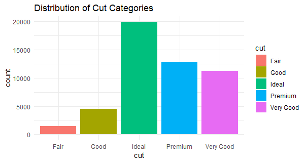
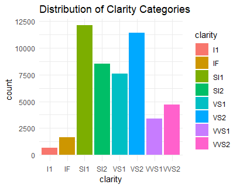

# diamond_dataset_analytics_project_with_Rprogramming

Full Fletched analytical project with R on the diamond dataset

### Dataset Information

This dataset isn't just about price tags; it delves into the very essence of these precious stones. Each diamond is meticulously described by:

-   **Price:** The monetary value, reflecting the carat weight, cut, clarity, and color;

-   **Carat:** The weight of the diamond, its physical size.

-   **Cut:** The artistry of shaping the diamond, impacting its sparkle and light play. (Fair, Good, Very Good, Premium, Ideal)

-   **Color:** The diamond's inherent hue, ranging from the near-colorless D to the warmer J.

-   **Clarity:** The presence of internal imperfections, influencing the diamond's purity. (Internal Flawless, Very Very Slight Inclusions, etc.)

-   **Dimensions:** The length, width, and depth of the diamond, revealing its proportions.

-   **Depth percentage:** The ratio of depth to average width, indicating its cut style.

-   **Table:** The width of the top facet, affecting light reflection.

-   **Cutlet:** The size of the facet at the bottom, influencing its durability.

### Data Exploration

#### Distribution of Cut Categories

### Distribution of clarity distribution

{width="533" height="371"}
